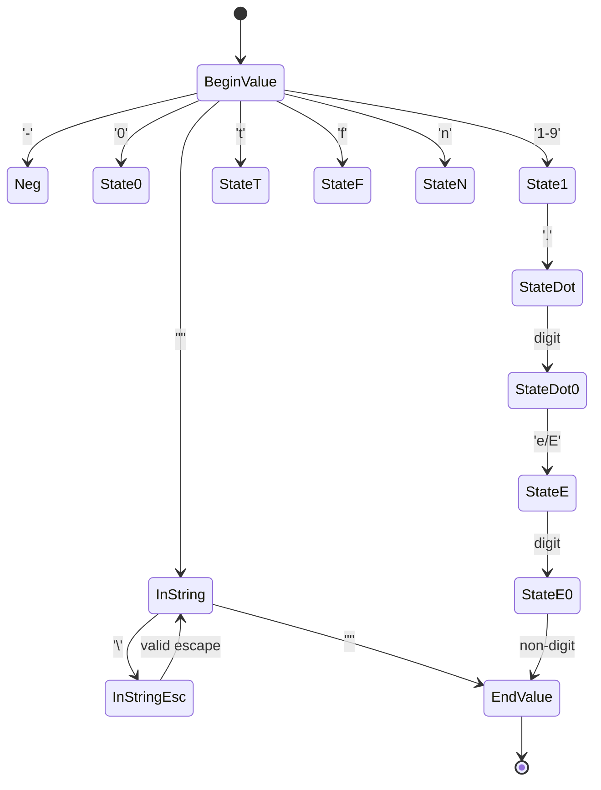
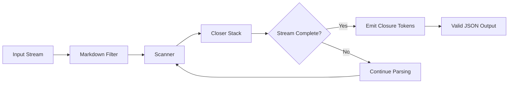

## The Problem: The Hidden O(n²) Bottleneck in Streaming

When we talk about LLM "streaming," we're usually receiving data in small chunks via SSE (Server-Sent Events). The standard approach to handling this in Go often looks something like this:

1. Receive a new chunk.
2. Append it to an `accumulator` buffer.
3. Call `json.Unmarshal(accumulator, &target)`.
4. Update the UI/state.

While simple, this pattern hides a **performance disaster**. On every new chunk, the library re-scans the *entire* accumulated response:

```
Chunk 1: {"content": "H"           → Parse 17 bytes
Chunk 2: {"content": "He"          → Parse 18 bytes  
Chunk 3: {"content": "Hel"         → Parse 19 bytes
...
Chunk N: {"content": "Hello..."}   → Parse 17+N bytes
```

For a 10KB response delivered in 100 chunks, you aren't just parsing 10KB; you're parsing the data redundantly, leading to **O(n²)** complexity relative to the number of packets and total size—approximately 5,000 redundant parse operations.

## The Solution: A Resumable State Machine

To solve this, I built [go-llm-stream](https://github.com/camilbenameur/go-llm-stream). Instead of re-parsing, it uses a **byte-level state machine** that processes each byte exactly once.

### State Machine Architecture

The core insight is that JSON parsing can be expressed as a finite state machine with 27 distinct states. Here's the high-level transition logic:



### The 27 States Explained

The scanner tracks exactly where parsing stopped, organized into logical groups:

```go
// From scanner/state.go - All 27 states mapped from Go stdlib
const (
    // Value Entry States
    StateBeginValue         State = iota // Start of any value
    StateBeginValueOrEmpty               // After '[', expecting value or ']'
    StateBeginStringOrEmpty              // After '{', expecting key or '}'
    StateBeginString                     // Expecting object key

    // String Parsing States (6)
    StateInString      // Inside string literal
    StateInStringEsc   // After '\' in string
    StateInStringEscU  // After '\u'
    StateInStringEscU1 // After '\uX'
    StateInStringEscU2 // After '\uXX'
    StateInStringEscU3 // After '\uXXX'

    // Number Parsing States (8)
    StateNeg   // After '-'
    State0     // After leading '0'
    State1     // After non-zero digit
    StateDot   // After decimal point '.'
    StateDot0  // After decimal digits
    StateE     // After 'e' or 'E'
    StateESign // After exponent sign
    StateE0    // After exponent digits

    // Literal Parsing States - true/false/null
    StateT, StateTr, StateTru           // t → tr → tru → true
    StateF, StateFa, StateFal, StateFals // f → fa → fal → fals → false
    StateN, StateNu, StateNul            // n → nu → nul → null

    // Completion States
    StateEndValue // After completing a value
    StateEndTop   // After top-level value complete
    StateError    // Error state (terminal)
)
```

### How Resumability Works

When a chunk arrives, the scanner picks up exactly where it halted—mid-string, mid-number, or mid-object—and continues:

```go
// The scanner "remembers" where it left off
for token := range healer.Tokens() {
    process(token)
}
```

This transforms the complexity from O(n²) to linear **O(n)**.

## Engineering for Zero Allocations

Performance in Go isn't just about algorithmic complexity; it's about the Garbage Collector (GC). Every allocation is a potential GC pause. `go-llm-stream` makes extensive use of `sync.Pool` to recycle buffers and minimize heap allocations.

### Benchmark Results

Here are the actual benchmark results from the library (tested on AMD Ryzen 5 7600X):

| Benchmark | Operations | ns/op | MB/s | B/op | allocs/op |
|:----------|:----------:|------:|-----:|-----:|----------:|
| **ScannerSmall** | 13,636,113 | 85.37 | **316.28** | **0** | **0** |
| **ScannerMedium** | 131,680 | 8,481 | **318.60** | **0** | **0** |
| Closer_Feed | 6,425,085 | 180.5 | 448.84 | **0** | **0** |
| StripMarkdown | 1,709,116 | 700.4 | 115.64 | **0** | **0** |

**Key Insight**: The core byte-level scanner achieves **zero allocations** and processes JSON at over **316 MB/s**, validating the O(n) design goal.

### Memory Stability Under Load

The stress test processes 100,000 JSON objects (800,001 tokens) with:

- **Total Duration**: ~700ms
- **Heap In Use**: ~4 MB (constant)
- **Total Allocations**: ~890 MB throughput with pool reuse

This demonstrates **constant memory overhead** regardless of input size.

## Auto-Healing: The "Magic" Sauce

One common issue with LLM outputs is that they can be cut off due to token limits or network errors, leaving you with invalid JSON like:

```json
{"status": "succe
```

### Before: Broken JSON

```go
// Traditional approach - CRASHES
resp := `{"status": "succe`
var result map[string]any
json.Unmarshal([]byte(resp), &result) // ❌ Error: unexpected end of JSON input
```

### After: Auto-Healed JSON

```go
// With go-llm-stream Healer
healer := stream.NewHealer(ctx, strings.NewReader(resp))
for token := range healer.Tokens() {
    // ✅ Outputs valid tokens, auto-closes the string and object
}
// Result: {"status": "succe"}  ← Valid JSON!
```

The Healer maintains a stack of open delimiters (`{`, `[`, `"`) and automatically closes them when the stream ends prematurely:



### Healer Configuration Options

```go
// From healer/healer.go
type HealerOptions struct {
    StripMarkdown      bool // Filter ```json code blocks
    AutoClose          bool // Auto-close unclosed containers
    IgnoreTrailingJunk bool // Ignore content after root closes
    CompleteStrings    bool // Close unterminated strings
    CompleteLiterals   bool // Complete partial true/false/null
}
```

## Comparison with Standard Library

The `encoding/json` package's streaming approach accumulates the entire buffer and re-parses on each chunk. For a 1MB streaming response:

| Approach | Parse Operations | Complexity |
|:---------|:----------------:|:----------:|
| **encoding/json** | ~500 full parses (2KB chunks) | O(n²) |
| **go-llm-stream** | 1 incremental parse | O(n) |

## Real-World Usage

```go
import "github.com/camilbenameur/go-llm-stream/stream"

// Connect to LLM API with SSE streaming
resp, _ := http.Get("https://api.openai.com/v1/chat/completions")
defer resp.Body.Close()

// Automatically fix truncated JSON and strip markdown
healer := stream.NewHealer(ctx, resp.Body)
defer healer.Close()

for token := range healer.Tokens() {
    // Process tokens as they arrive with zero re-parsing
    fmt.Print(token.Value)
}
```

## Conclusion: Making Infrastructure Invisible

Good infrastructure should be invisible. By optimizing the parsing layer, we reduce CPU usage and latency, making LLM-driven applications feel more responsive.

The key engineering decisions that made this possible:

1. **State Machine Design**: 27 enumerated states replace function pointers for resumability
2. **Zero-Allocation Hot Path**: `sync.Pool` for all buffer recycling
3. **Defensive Healing**: Stack-based delimiter tracking for robust error recovery
4. **O(n) Guarantee**: Each byte processed exactly once

If you're building Go applications that rely on high-volume LLM streaming, check out the project on GitHub: **[go-llm-stream](https://github.com/camilbenameur/go-llm-stream)**

---

*I'm currently exploring the intersection of distributed systems and AI infrastructure. Feel free to connect with me on [LinkedIn](https://www.linkedin.com/in/camil-benameur-14a762194/) to discuss technical architecture and engineering challenges.*
